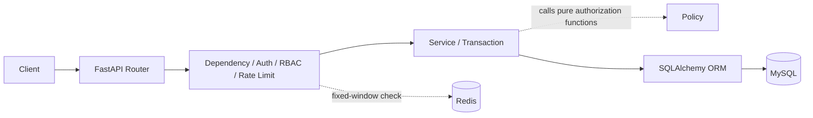
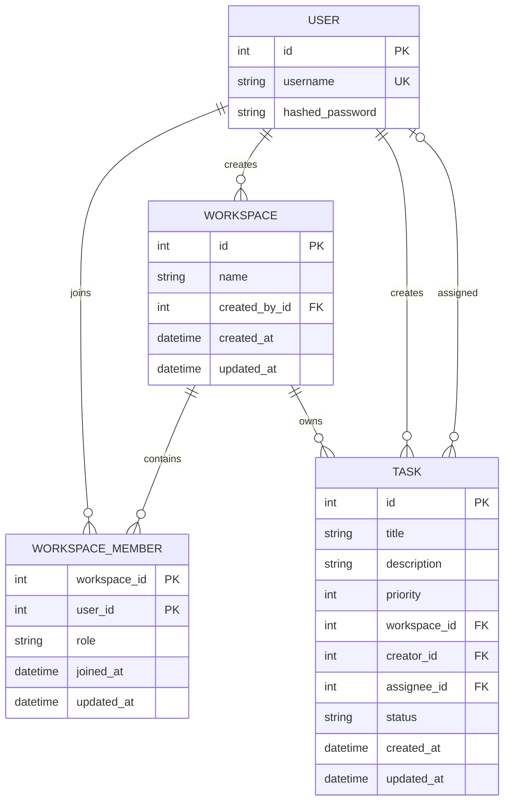

# Task Management API

一个基于 FastAPI 的多人协作任务管理后端。项目从单用户 Task CRUD 演进为以 Workspace 为边界的协作系统，覆盖固定角色权限、成员管理、任务状态与指派工作流、数据库迁移、Redis API 限流和自动化测试。

当前仓库只包含后端 API；没有前端页面，也没有公开部署地址。

## 核心功能

- 用户注册、OAuth2 password form 登录、Argon2 密码哈希与 HS256 JWT Bearer 鉴权。
- Workspace 创建、列表与成员隔离；创建者自动成为唯一的初始 OWNER，当前 API 不允许创建第二个 OWNER，也不支持 Owner 转移。
- `OWNER`、`ADMIN`、`MEMBER` 三种固定角色及成员增删、角色调整规则。
- Workspace 内嵌套 Task CRUD，支持分页、过滤和稳定排序。
- `TODO`、`IN_PROGRESS`、`DONE` 状态工作流。
- 独立的任务状态和负责人接口，支持管理员指派、MEMBER 自领与放弃。
- 移除成员时，在同一事务中解除其未完成任务指派；DONE 任务保留历史负责人。
- Redis 固定窗口限流：认证入口 fail-closed，已认证写操作 fail-open。
- Alembic 分阶段迁移、真实 MySQL/Redis 探针、并发测试与 GitHub Actions CI。

## 技术栈

| 层次 | 技术 |
|---|---|
| API | Python 3.13、FastAPI、Uvicorn |
| 数据校验 | Pydantic v2 |
| 数据访问 | SQLAlchemy 2.0、PyMySQL |
| 数据库 | MySQL 9.7.2、Alembic |
| 鉴权 | PyJWT、pwdlib/Argon2 |
| 限流 | Redis 7.4.2、redis-py、Lua |
| 测试 | pytest、pytest-cov、FastAPI TestClient |
| 运行环境 | Dockerfile、Docker Compose |
| CI | GitHub Actions |

## 架构概览



Dependency 先建立当前用户、Workspace 成员关系和 Task 资源边界；Service 根据这些边界及用例中的实时状态调用纯 Policy 函数完成具体业务授权。Policy 不访问数据库、不管理事务，也不是 FastAPI 中间件或 Dependency 与 Service 之间的独立处理层。Router 和 Dependency 不提交事务。

更详细的请求链路、模块职责、事务、并发和测试分层见 [架构说明](docs/architecture.md)。

## 数据模型



关键约束：

- `User.username` 唯一；密码只保存哈希。
- `Workspace.name` 去除首尾空白后长度为 1～100；`created_by_id` 记录创建来源，当前 API 不提供修改入口，实际管理权限以实时成员角色为准。
- 数据库没有使用触发器保证 `created_by_id` 不可变；任何未来的后台任务、管理脚本或直接数据库写入都必须维护这一应用层不变量。
- `WorkspaceMember` 使用 `(workspace_id, user_id)` 复合主键；角色 CHECK 只限制三种合法取值，不限制 OWNER 数量。当前 API 通过 Workspace 创建 Service、请求 Schema 和 Policy 维护单 OWNER 不变量。
- Task 必须属于 Workspace 并保留 creator；assignee 可空。title、priority、status 均有数据库 CHECK。
- Task 的 Workspace、creator、assignee 外键均使用 `ON DELETE RESTRICT`；角色和状态保存为 `VARCHAR + CHECK`，不是 MySQL 原生 ENUM。

## 权限矩阵

| 能力 | OWNER | ADMIN | MEMBER |
|---|---|---|---|
| 查看 Workspace、成员和 Task | 允许 | 允许 | 允许 |
| 添加 MEMBER | 允许 | 允许 | 不允许 |
| 添加 ADMIN | 允许 | 不允许 | 不允许 |
| 在 ADMIN/MEMBER 间调整角色 | 允许 | 不允许 | 不允许 |
| 移除 MEMBER | 允许 | 允许 | 不允许 |
| 移除 ADMIN | 允许 | 不允许 | 不允许 |
| 修改或移除 OWNER | 不允许 | 不允许 | 不允许 |
| 创建 Task | 允许 | 允许 | 允许 |
| 修改或删除任意 Task | 允许 | 允许 | 不允许 |
| 修改或删除自己创建的 Task | 允许 | 允许 | 允许 |
| 修改任意 Task 状态 | 允许 | 允许 | 不允许 |
| 推进指派给自己的 Task | 允许 | 允许 | 按状态机允许 |
| 指派、改派或解除任意未完成 Task | 允许 | 允许 | 不允许 |
| 自领未指派 Task、放弃自己的 Task | 允许 | 允许 | 允许，仅未完成 Task |

不存在的 Workspace 与“当前用户不是成员”统一返回 404。通过成员边界后，角色不足返回 403；Task ID 不存在或属于另一个 Workspace 统一返回 Task 404，避免通过错误差异枚举资源。

## Task 状态与指派规则

- 新 Task 固定从 `TODO`、未指派状态开始，`creator_id` 来自当前登录用户。
- OWNER/ADMIN 可以在 `TODO`、`IN_PROGRESS`、`DONE` 之间任意切换，包括重新打开 DONE Task。
- MEMBER 必须是当前 assignee，且只能执行 `TODO → IN_PROGRESS → DONE`；不能直接 `TODO → DONE`，也不能重新打开 DONE Task。
- OWNER/ADMIN 只能将未完成 Task 指派给当前 Workspace 成员，也可以改派或解除指派。
- MEMBER 只能自领当前未指派的未完成 Task，或解除自己当前负责的未完成 Task，不能替其他成员指派。
- DONE Task 的负责人被冻结；相同 assignee 的幂等请求仍成功。若需改派，OWNER/ADMIN 必须先重新打开任务。
- 相同 status 或 assignee 的请求是幂等操作，返回当前 Task，且不改变 `updated_at`。
- 移除成员时，未完成 Task 的 `assignee_id` 在同一事务中清空；DONE Task 保留历史 assignee，Task 与 `creator_id` 不会被删除。
- 通用 Task PATCH 只允许 `title`、`description`、`priority`；状态和负责人只能走专用接口。

## API 清单

### 认证

| 方法 | 路径 | 访问规则 | 请求重点 |
|---|---|---|---|
| POST | `/users/register` | 公开，注册限流 | JSON：`username`、`password` |
| POST | `/users/login` | 公开，登录限流 | OAuth2 form：`username`、`password` |
| GET | `/users/me` | 登录用户 | Bearer Token |

### Workspace

| 方法 | 路径 | 访问规则 | 请求重点 |
|---|---|---|---|
| POST | `/workspaces` | 登录用户 | JSON：`name`；创建者自动成为 OWNER |
| GET | `/workspaces` | 登录用户 | `limit`、`offset`；只返回自己的成员关系 |
| GET | `/workspaces/{workspace_id}` | 任意成员 | 响应包含 `current_role` |

### Membership

| 方法 | 路径 | 访问规则 | 请求重点 |
|---|---|---|---|
| GET | `/workspaces/{workspace_id}/members` | 任意成员 | `limit`、`offset` |
| POST | `/workspaces/{workspace_id}/members` | OWNER；ADMIN 仅可添加 MEMBER | JSON：`username`、`role` |
| PATCH | `/workspaces/{workspace_id}/members/{user_id}` | OWNER | JSON：`role`，只允许 ADMIN/MEMBER |
| DELETE | `/workspaces/{workspace_id}/members/{user_id}` | OWNER；ADMIN 仅可移除 MEMBER | OWNER 关系不可删除 |

### Task

| 方法 | 路径 | 访问规则 | 请求重点 |
|---|---|---|---|
| GET | `/workspaces/{workspace_id}/tasks` | 任意成员 | 状态、优先级、负责人、未指派过滤；分页与排序 |
| POST | `/workspaces/{workspace_id}/tasks` | 任意成员 | JSON：`title`、可选 `description`、`priority` |
| GET | `/workspaces/{workspace_id}/tasks/{task_id}` | 任意成员 | Task 必须属于路径 Workspace |
| PATCH | `/workspaces/{workspace_id}/tasks/{task_id}` | OWNER/ADMIN 或 creator | 仅 title、description、priority |
| DELETE | `/workspaces/{workspace_id}/tasks/{task_id}` | OWNER/ADMIN 或 creator | 成功返回 204 |
| PATCH | `/workspaces/{workspace_id}/tasks/{task_id}/status` | OWNER/ADMIN；或当前 assignee MEMBER | JSON：`status` |
| PATCH | `/workspaces/{workspace_id}/tasks/{task_id}/assignee` | OWNER/ADMIN；或 MEMBER 自领/放弃 | JSON：`assignee_id`，可为 null |

Task 列表支持：`status`、`priority`、`assignee_id`、`unassigned`、`limit`、`offset`、`sort_by` 和 `sort_order`。`assignee_id` 与 `unassigned=true` 不能同时使用。

交互式文档由 FastAPI 自动生成：`/docs`；OpenAPI JSON 位于 `/openapi.json`。

## 错误语义

领域异常统一为：

```json
{
  "code": "STABLE_ERROR_CODE",
  "message": "Human-readable message"
}
```

| HTTP | 使用边界 | 代表性错误码 |
|---:|---|---|
| 401 | 缺少/无效 Token，或登录凭据错误 | `INVALID_TOKEN`、`INVALID_CREDENTIALS` |
| 403 | 已确认是成员，但 Workspace 或 Task 权限不足 | `WORKSPACE_PERMISSION_DENIED`、`TASK_PERMISSION_DENIED` |
| 404 | Workspace 不存在/非成员；Task 不存在/跨 Workspace；授权后目标成员不存在 | `WORKSPACE_NOT_FOUND`、`TASK_NOT_FOUND`、`WORKSPACE_MEMBER_NOT_FOUND` |
| 409 | 重复用户名/成员、Owner 关系冲突、非法状态流转或指派冲突 | `USERNAME_ALREADY_EXISTS`、`WORKSPACE_MEMBER_ALREADY_EXISTS`、`OWNER_MEMBERSHIP_CONFLICT`、`TASK_STATUS_TRANSITION_CONFLICT`、`TASK_ASSIGNMENT_CONFLICT` |
| 422 | Pydantic 请求体或查询参数校验失败 | FastAPI 标准验证响应 |
| 429 | 限流窗口已耗尽 | `RATE_LIMIT_EXCEEDED`，包含 `Retry-After` 与限流响应头 |
| 503 | 登录/注册时 Redis 限流服务不可用 | `RATE_LIMIT_UNAVAILABLE` |

未处理异常返回脱敏的 `INTERNAL_SERVER_ERROR`，请求日志只记录方法、路径、状态码和耗时，不记录请求体、密码、Token 或连接凭据。

## Redis 限流

| 类别 | 默认窗口 | Key 维度 | Redis 故障策略 |
|---|---:|---|---|
| 登录 | 5 次 / 60 秒 | IP 摘要 + 规范化用户名摘要 | fail-closed，503 |
| 注册 | 3 次 / 3600 秒 | IP 摘要 | fail-closed，503 |
| 已认证写操作 | 60 次 / 60 秒 | 用户 + 操作 scope + 可选 Workspace | fail-open，继续原业务 |

- 使用固定窗口算法；Lua 将 `INCR`、TTL 修复和过期时间设置合并为 Redis 端原子操作。
- 每个写操作 scope、用户以及适用时的 Workspace 独立计数，不是所有写请求共享一个总桶。
- 原始 IP 和用户名不进入 Redis Key；SHA-256 摘要只用于避免 Key 明文暴露，是稳定的伪名标识，不宣称不可逆匿名化。
- 当前只信任 `request.client.host`，忽略未建立信任边界的代理头。
- GET、`/health` 与 OpenAPI 不消耗限流计数。
- Compose 中 Redis 不发布宿主机端口；`/data` 使用 tmpfs，RDB/AOF 均关闭，不使用持久化 Docker volume。容器停止或重建会清空限流窗口。

## 事务与并发

- Router 和 Dependency 只负责输入、身份、资源边界与限流，不调用 `commit()` 或 `rollback()`。
- 顶层写 Service 拥有完整用例事务，并在 SQLAlchemy 异常时回滚。
- 需要返回数据库默认值的协作写用例遵循“写入 → `flush()` → `refresh()` → 构造响应 → `commit()`”，提交后不再访问数据库。
- Workspace 与 OWNER membership 同事务创建；成员删除与未完成任务解除指派同事务完成。
- 状态、指派和成员移除使用 `SELECT ... FOR UPDATE`。指派工作流先按稳定顺序锁定 Membership，再锁 Task，减少竞态和锁顺序反转。
- 并发自领保证最多一个 MEMBER 成功；成员移除与指派的两种关键交错均有确定性测试。

详见 [架构说明](docs/architecture.md#事务与并发控制)。

## 数据库迁移

旧 Task 的 `owner_id`/`completed` 通过 expand、backfill、contract 三阶段迁移为 Workspace、`creator_id`、可空 `assignee_id` 和 `status`。迁移为每个旧用户建立个人 Workspace 与 OWNER 成员关系，并验证旧数据不变量后再收紧非空约束、删除旧字段。

当前唯一 Alembic head 是 `e5a1c7d9b302`。该 revision 在完整结构与数据校验后删除只用于迁移的映射表。清理是明确的不可逆边界：downgrade 会在任何 DDL/DML 前拒绝执行；跨越此边界只能恢复清理前备份，不能使用 `stamp` 伪造状态。

完整 revision 链、回滚边界和验证方法见 [数据库迁移说明](docs/database-migrations.md)。

## 本地启动

前置条件：Docker、Docker Compose，以及可用的 8000/3307 宿主机端口。

```bash
cp .env.example .env
# 编辑 .env，将所有示例占位值替换为仅供本机使用的值
docker compose config --quiet
docker compose up -d --build
docker compose ps
curl --noproxy "*" http://127.0.0.1:8000/health
```

访问地址：

- API：`http://127.0.0.1:8000`
- Swagger UI：`http://127.0.0.1:8000/docs`
- OpenAPI：`http://127.0.0.1:8000/openapi.json`

`/health` 只表示 API 进程存活，不检查 MySQL 或 Redis readiness。Compose 启动 API 前等待 MySQL healthy，并运行 `alembic upgrade head`；对包含重要数据的环境应先审查迁移并完成可恢复备份。

停止服务：

```bash
docker compose down
```

不要在需要保留数据时使用 `docker compose down -v`。MySQL 使用命名 volume；Redis 限流数据是 tmpfs 中的临时数据。

## 测试

最近一次已验证的仓库默认测试结果：**190 passed，94.40% coverage**。`pytest.ini` 开启分支覆盖率并设置 85% 最低门槛。

```bash
python3.13 -m venv .venv
source .venv/bin/activate
python -m pip install -r requirements.txt
python -m pip install pytest==9.1.1 pytest-cov==7.1.0
python -m pytest
```

测试必须使用专用、可销毁的 MySQL 数据库：

- `TEST_DATABASE_URL` 必须存在、使用 MySQL、数据库名匹配 `*_test_db`，且与 `DATABASE_URL` 和受保护库名不同。
- `TEST_DATABASE_RESET_ALLOWED=true` 是执行测试的显式销毁许可。
- fixture 会执行 `drop_all()`/`create_all()`；不要指向开发、预发布或生产数据库。
- 建议使用仅拥有测试库权限的非 root 账号；CI 强制使用该方式。
- 默认测试包含真实 MySQL 约束探针、Alembic 往返/不可逆边界测试、真实 Redis Lua 并发探针、权限矩阵、事务回滚和确定性并发测试，因此需要本机 Docker daemon。

## 持续集成

GitHub Actions 的 `CI` workflow 在以下情况运行：

- push 到 `main` 或 `stage5/**`；
- 向 `main` 发起 Pull Request；
- 手工 `workflow_dispatch`。

CI 使用 Python 3.13 和 MySQL 9.7.2 service，主测试连接使用仅限专用测试库的非 root 账号。它不读取真实 `.env`、不连接开发数据库、不部署服务，权限仅为 `contents: read`。GitHub-hosted runner 的 Docker daemon 用于一次性 MySQL/Redis 探针，结束后检查精确命名的临时容器是否残留。

面向 `main` 的 PR 应以默认 `python -m pytest`、85% 覆盖率门槛和临时资源清理检查全部通过作为合并条件。

## 项目边界与后续计划

当前明确不包含：

- 前端页面与公网部署；
- Refresh Token 与 Token 撤销机制；
- 邮件邀请、Owner 转移与 Workspace 删除；
- 评论、ActivityLog、附件、标签和子任务；
- Redis/Celery 异步任务、消息队列和 WebSocket；
- 任意自定义 RBAC 规则。

后续可在不破坏现有边界的前提下增加轻量前端、公开部署与可观测性，再评估面向任务知识的 AI/RAG 辅助能力。项目不会为了展示技术栈而提前引入与业务深度无关的组件。

## 深入阅读

- [架构说明](docs/architecture.md)
- [数据库迁移说明](docs/database-migrations.md)
- 运行时 API 契约：启动服务后的 `/docs` 与 `/openapi.json`
