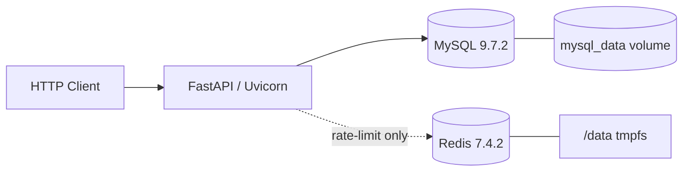
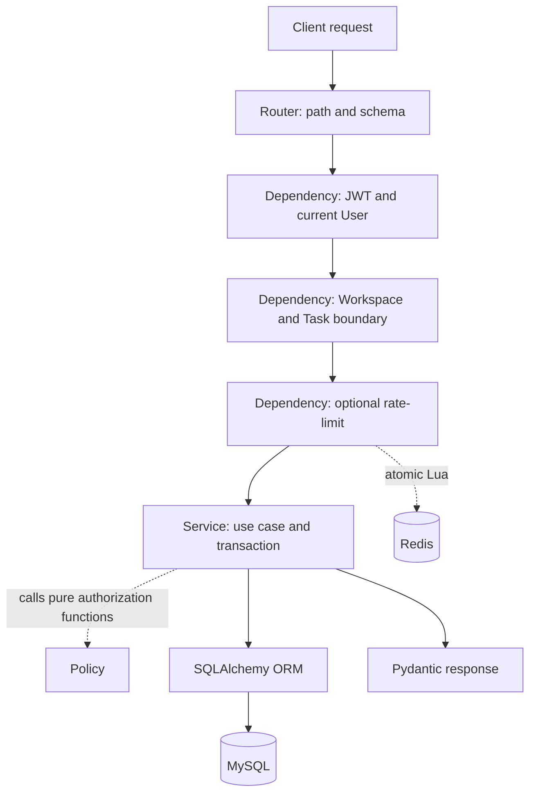
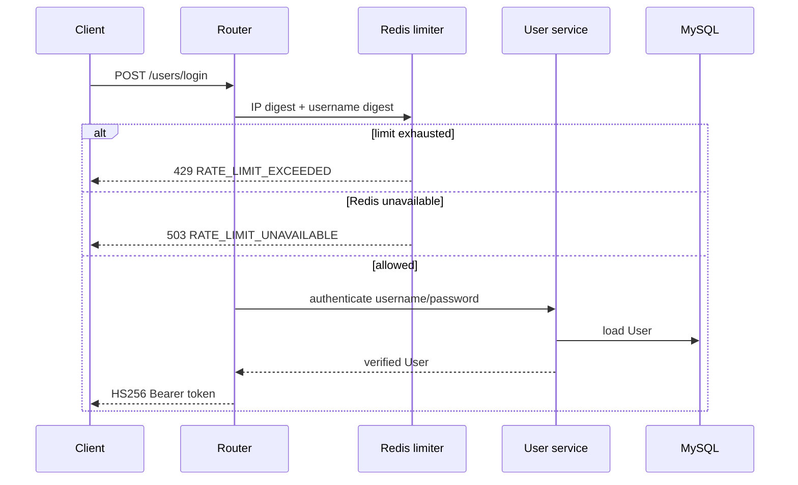
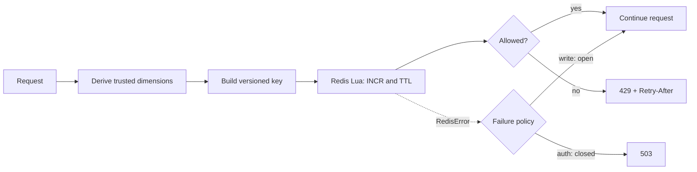

# 架构说明

本文描述当前仓库在 Alembic head `e5a1c7d9b302` 下的实现。它补充 README 中的快速介绍，重点解释请求边界、模块职责、事务、并发、限流和测试分层。

## 系统边界

这是一个同步 REST API：FastAPI 处理 HTTP，请求内使用同步 SQLAlchemy Session 访问 MySQL，并在需要限流时通过同步 redis-py 客户端执行 Lua。应用没有前端、后台任务队列、WebSocket 或外部身份提供方。

MySQL 保存业务数据和 Alembic revision。Redis 只保存短期限流计数：不发布宿主机端口、关闭 RDB/AOF、`/data` 使用 tmpfs，因此容器停止或重建后窗口清空。

## 请求链路

图中的 Policy 是 Service 调用的纯函数，而不是一个会访问数据库的中间件。Dependency 先证明身份和资源边界，Service 再把实时角色、creator、assignee 和状态传给 Policy 做具体授权判断。Policy 不管理事务，也不是 FastAPI 中间件、Dependency，或 HTTP 请求进入 Service 前的独立处理层。

典型 Task 写请求：

1. Router 解析 Workspace/Task 路径参数及 Pydantic 请求体。
2. `get_current_user` 解码 JWT，并从数据库读取当前 User。
3. `get_workspace_access` 用 Workspace 与 Membership 联表查询证明成员关系；查不到统一抛出 `WORKSPACE_NOT_FOUND`。
4. Task 资源接口再按 `(task_id, workspace_id)` 查询，避免跨 Workspace 枚举。
5. 写接口在身份和资源权限通过后，以用户、scope 和 Workspace 构造限流桶。
6. Service 根据实时角色与 Task 状态调用纯 Policy 函数，并拥有整个写事务。
7. Pydantic response schema 从已构造的返回数据序列化响应。

## 模块职责

| 模块 | 当前职责 |
|---|---|
| `app/main.py` | 创建 FastAPI 应用，挂载路由，注册统一异常处理、请求日志中间件和 Redis 关闭钩子 |
| `app/config.py` | 从环境和 `.env` 读取数据库、JWT、Redis 与限流设置，并校验 Redis URL/数值范围 |
| `app/database.py` | 创建 Engine、Declarative Base、SessionLocal 和请求级 `get_db()` |
| `app/models.py` | 定义 User、Workspace、WorkspaceMember、Task 及关系、CHECK、索引和外键 |
| `app/enums.py` | 定义共享字符串枚举 `MemberRole`、`TaskStatus` |
| `app/schemas.py` | 定义请求/响应模型、字段范围、extra 禁止规则和列表查询校验 |
| `app/security.py` | Argon2 密码哈希/校验与 HS256 JWT 创建/解析 |
| `app/dependencies.py` | 当前用户、WorkspaceAccess、WorkspaceTaskAccess、角色门禁和已认证写限流依赖 |
| `app/policies.py` | 无数据库副作用的成员管理、Task 编辑/删除、状态流转和自领/放弃规则 |
| `app/rate_limiter.py` | Redis 连接池、固定窗口 Lua、Key 构造、认证限流和写限流故障策略 |
| `app/exceptions.py` | 稳定领域错误码、HTTP 状态和限流响应头 |
| `app/routers/` | HTTP 路径、依赖组合、请求/响应 Schema，不拥有事务 |
| `app/services/` | 查询与完整业务用例，写事务、锁、rollback 和领域日志 |
| `alembic/` | 线性 Schema 版本、数据回填和不可逆清理边界 |
| `tests/` | API、Policy、ORM、迁移、事务、并发及真实 MySQL/Redis 集成验证 |

## 认证链路

- 登录 body 使用 OAuth2 password form；注册使用 JSON。
- JWT 的 `sub` 当前保存 username，默认有效期 30 分钟。
- 缺少或无法解析的 Token 返回 401 `INVALID_TOKEN`；登录失败返回 401 `INVALID_CREDENTIALS`。
- Workspace 角色不写入 JWT。每个新进入受保护边界的请求都读取数据库中的当前成员关系；在途事务的撤权边界见下文。
- 密码、密码哈希、JWT、Authorization header、数据库 URL 和 Redis URL 不应进入日志。

## Workspace 与资源隐藏

`WorkspaceAccess` 是不可变的数据类，包含 `workspace`、当前用户的 `membership` 和 `current_user`。查询使用 Workspace 与 WorkspaceMember 联表，并同时匹配 `workspace_id` 与当前 User ID。

这一边界形成固定错误顺序：

1. 未认证先返回 401。
2. Workspace 不存在或当前用户不是成员，统一返回 404 `WORKSPACE_NOT_FOUND`。
3. 只有成员边界通过后，角色不足才返回 403。
4. Task 查询在 Workspace 边界后按 Task ID 与 Workspace ID 同时过滤；不存在或跨 Workspace 都返回 404 `TASK_NOT_FOUND`。
5. 目标 username/user_id 的存在性只在调用者通过 Workspace 权限后暴露。

Workspace 创建 Service 会插入一个 Workspace 和一个创建者 OWNER membership；客户端成员 Schema 不接受 OWNER，Policy 也不允许添加第二个 OWNER、修改 OWNER 或删除 OWNER。因而“单 OWNER”是当前 API/应用边界维护的不变量，而不是数据库绝对约束：数据库角色 CHECK 只限制角色取值，不限制 OWNER 数量。任何未来的后台任务、管理脚本或直接数据库写入都必须继续维护该不变量。

`Workspace.created_by_id` 记录创建来源，当前 API 没有修改入口；实际管理权限只由实时 `WorkspaceMember.role` 决定。数据库没有使用触发器保证 `created_by_id` 不可变，因此非 API 写入路径必须维护这一应用层不变量。当前也没有 Owner 转移或 Workspace 删除接口。

## Schema 与字段级权限

写 Schema 使用 `extra="forbid"`，防止客户端注入服务端控制字段：

- `WorkspaceCreate` 只接受 name。
- `WorkspaceMemberCreate` 只接受 username，以及 ADMIN/MEMBER；客户端不能创建 OWNER。
- `TaskCreate` 只接受 title、description、priority；Workspace、creator、assignee、status 和时间戳由服务端控制。
- `TaskUpdate` 只接受 title、description、priority，且空 PATCH 被拒绝。
- `TaskStatusUpdate` 和 `TaskAssigneeUpdate` 分别用于专用工作流。

因此 MEMBER 无法通过通用 PATCH 绕过状态或负责人权限。

## Policy 边界

Policy 不查询数据库、不提交事务，只根据传入事实返回布尔值：

- 成员管理：OWNER 可管理 ADMIN/MEMBER；ADMIN 只能添加或移除 MEMBER；OWNER 关系不能修改或移除。
- Task 编辑/删除：OWNER/ADMIN 可以操作任意 Task；MEMBER 只能操作自己的 creator Task。
- Task 状态：OWNER/ADMIN 可在所有状态间移动；MEMBER 必须是当前 assignee，且只可向前推进。
- Task 指派：OWNER/ADMIN 可管理任意未完成 Task；MEMBER 只可自领未指派 Task或放弃自己当前负责的 Task。

目标成员是否仍存在、Task 是否属于 Workspace、并发后状态是否变化等数据库事实由 Service 在锁内重新读取。

## 事务与并发控制

### 基本边界

- Router 与 Dependency 不调用 `commit()`/`rollback()`。
- 一个顶层写 Service 对应一个完整用例，最多提交一次。
- SQLAlchemy 写异常统一 rollback，并继续抛出未知数据库异常。
- 协作写接口需要数据库默认值时，先 `flush()`，再 `refresh()`、构造响应，最后 `commit()`；提交后不再查询或 refresh。
- `SessionLocal` 使用 `autoflush=False`、`expire_on_commit=False`；请求结束始终关闭 Session。

Workspace 创建在同一事务中插入 Workspace 与 OWNER membership。成员移除在同一事务中批量清空该用户的未完成 Task 指派，再删除 membership；任一步失败都会回滚。

### 状态和指派

状态或指派写请求不能依赖 Dependency 较早读取的对象作为最终事实。Service 会：

1. 使用 `SELECT ... FOR UPDATE` 锁定当前 actor membership；指派到其他用户时也锁定目标 membership。
2. membership 按 user_id 排序后统一加锁，形成稳定顺序。
3. 再按 `(task_id, workspace_id)` 锁定 Task，并强制刷新 ORM 状态。
4. 在锁内重新执行权限、状态和成员存在性判断。
5. 更新、flush、refresh、构造响应并提交；领域冲突也显式 rollback，以及时释放锁。

### 关键竞态

- 两个 MEMBER 同时自领同一 Task：两者最终串行获得 Task 锁，只有第一个看到未指派状态并成功；另一个获得 `TASK_ASSIGNMENT_CONFLICT`。
- 指派先锁目标 membership：成员移除等待该锁；指派提交后，移除继续并清空未完成指派。
- 移除先锁目标 membership：指派等待；移除提交后，指派重新读取不到 membership，返回 `WORKSPACE_MEMBER_NOT_FOUND`。
- DONE Task 的历史 assignee 保留；未完成 Task 不会在成员移除后留下指向非成员的有效指派。

这些交错使用独立 Session、Barrier/Event 和超时做确定性测试，不依赖 sleep。

### 撤权与在途请求边界

已完成权限检查并已进入事务的在途请求可能先于撤权操作完成；撤权保证作用于撤权提交后开始或重新检查权限的请求。状态和指派等关键竞争路径会额外锁定并重读 actor/target membership，但数据库锁只确定事务的串行顺序，不会自动让撤权操作获得绝对优先级。

项目没有承诺撤权会使所有已经开始的请求失败。这是当前事务串行语义，不是已确认漏洞；在没有更强产品要求和确定性交错测试前，不为所有写路径引入全面 membership 锁。

## Redis 限流架构

默认策略：

- login：5/60 秒，IP 摘要与规范化 username 摘要共同组成 Key。
- register：3/3600 秒，IP 摘要组成 Key。
- authenticated write：60/60 秒，每个 user、scope 和适用时的 Workspace 独立计数。

Lua 以单个服务器端操作完成计数、首次设置 TTL 以及异常 TTL 修复。固定窗口实现简单且可原子计数，但允许相邻窗口边界突发；当前没有声称滑动窗口的平滑能力。

Redis client/pool 在模块加载时创建对象，但不会主动 ping；实际连接是惰性的。因此 Redis 不可用不会阻止 API import/startup。登录和注册 fail-closed，避免在限流不可判定时绕过认证入口；已认证写操作 fail-open，并记录不含 Token、密码或原始身份值的结构化 WARNING。

SHA-256 只避免原始 IP/username 直接出现在 Key 和限流日志中。摘要仍是稳定的伪名标识，不是不可逆匿名化。当前未配置可信反向代理，所以只使用 `request.client.host`，忽略 `X-Forwarded-For` 与 `X-Real-IP`。

## 异常和日志

`AppException` 由全局 handler 序列化为 `{"code": ..., "message": ...}`，必要时附加 `WWW-Authenticate`、`Retry-After` 和 `X-RateLimit-*` 响应头。Pydantic/FastAPI 的 422 保留标准验证结构；未知异常只向客户端返回脱敏的 500。

请求中间件记录 method、path、status 和 duration。安全日志使用 user_id、scope、workspace_id 或固定 reason，不记录密码、Token、Authorization header、请求体、连接 URL 或 `.env` 内容。应用 SQLAlchemy Engine 启用 `hide_parameters=True`，避免 SQLAlchemy 日志和异常文本展示绑定参数；它不隐藏应用代码主动写入日志的业务数据，因此日志字段仍必须遵守上述约束。

### OpenAPI 契约边界

OpenAPI 主要描述路径、请求/响应 Schema 和成功响应；部分稳定领域错误码记录在 README 的错误表中。当前没有为每个 operation 在 OpenAPI 中完整枚举所有 401/403/404/409/429/503 响应，因此客户端不能只依赖 `/openapi.json` 获得完整错误契约。

## 运行时与容器

- API 镜像基于 `python:3.13-slim`，安装 `requirements.txt` 后复制项目并运行 Uvicorn。
- Compose MySQL 使用 `mysql:9.7.2`，宿主机映射到 3307，并把 `/var/lib/mysql` 保存到 `mysql_data` 命名 volume。
- Compose Redis 使用 `redis:7.4.2-alpine`，只在内部网络暴露 6379，`/data` 为 tmpfs。
- API 只注入列出的数据库、JWT、Redis 和限流变量；Compose 读取根 `.env` 做插值不等于把整个文件注入 API。
- API command 在 Uvicorn 前执行 `alembic upgrade head`，并只等待 MySQL healthcheck。Redis 故障由请求级策略处理。
- `/health` 只返回进程存活状态，不探测 MySQL 或 Redis。

当前 Compose 只用于本地单实例开发；在 API 启动前自动运行迁移是本地便利设计。多实例或包含重要数据的环境应通过一次性、显式步骤执行并核验迁移，再启动应用实例。HTTPS、可信代理、CORS、Secret Manager、readiness 和公网网络边界尚未实现，由 Stage 6D 的具体部署方案决定。

## 测试分层

最近一次本地完整测试结果为 194 passed、94.93% coverage，默认门槛为 85%；目标提交的 GitHub Actions 结果需要在推送后单独核验，最终 Release 前仍需确认目标 SHA 的 CI 结论。测试层次包括：

1. Policy 与 Schema：纯权限规则、枚举、字段级限制、非法 payload。
2. API/Service 集成：FastAPI TestClient + 真实 MySQL，覆盖认证、RBAC、隔离、CRUD、工作流、错误顺序和 rollback。
3. ORM 约束：静态反射检查列、CHECK、索引、外键；独立普通 Python 子进程在一次性 MySQL 9.7.2 中执行真实非法 DML。
4. 并发：独立 Session 和确定性 Barrier/Event 验证自领、指派与成员移除交错。
5. Redis：依赖覆盖用于普通 API 测试；一次性 Redis 7.4.2 容器验证 Lua、TTL、原子并发和故障策略。
6. Alembic：在专用可销毁 MySQL 中执行历史往返、fresh upgrade、autogenerate cleanliness、清理 revision 和拒绝 downgrade。
7. CI：Python 3.13、非 root MySQL 9.7.2 service、默认 pytest、覆盖率门槛和临时探针残留检查。

测试 fixture 会销毁目标 Schema，因此 `TEST_DATABASE_URL` 必须通过数据库名、开发库隔离和显式 reset 许可三重门禁。详见 README 的测试章节。

## 已知边界

- 固定三角色，不支持自定义 RBAC/ABAC。
- JWT 没有 refresh/revocation 流程。
- 无 Workspace 删除和 Owner 转移。
- 无邀请、评论、ActivityLog、附件、子任务和通知。
- 无后台任务、实时推送、前端或公开部署。
- Redis 限流窗口是有意的临时状态，容器重建后不会恢复。
